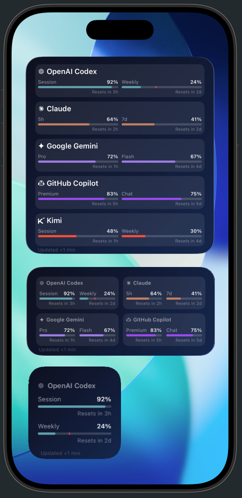
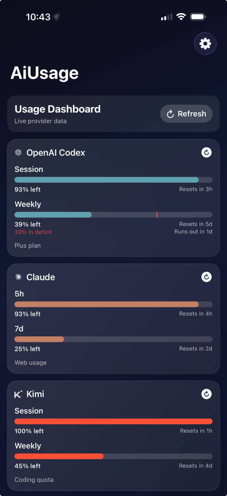
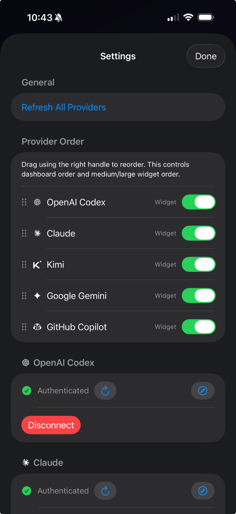

# AiUsage

Track AI usage quotas from your iPhone, with an optional home-screen widget.

- no app backend
- provider requests are in `AiUsage/Networking/ProviderAPIClients.swift`
- credentials are stored locally in iOS Keychain (`AiUsage/Auth/CredentialsStore.swift`)

## Supported providers

| Provider | Auth method |
|---|---|
| OpenAI Codex | OAuth or session cookie |
| Claude | OAuth token or session cookie |
| Gemini | OAuth |
| GitHub Copilot | Personal access token |
| Kimi | Session cookie |

## Requirements

- Xcode 26.2+
- iPhone or simulator on iOS 26.2+
- Apple Developer account (free personal team works)

## Install on your iPhone (Xcode)

1. Clone this repo and open `AiUsage.xcodeproj`.
2. Plug in your iPhone (or use wireless debugging), then select it as the run destination.
3. In **Targets**, open both `AiUsage` and `AiUsageWidgetExtension`:
   - **Signing & Capabilities** → set your **Team**
   - keep **Automatically manage signing** enabled
4. If signing fails, make IDs unique to your team:
   - bundle IDs for both targets
   - `Config/AiUsageWidget-Info.plist` (`WKAppBundleIdentifier`)
   - App Group in `Config/AiUsage.entitlements`, `Config/AiUsageWidget.entitlements`, and `Shared/WidgetSnapshotStore.swift`
5. On first device run, enable Developer Mode on iPhone if prompted.
6. Press **Run** (`Cmd+R`). Xcode installs directly to your phone.

## Use the app

1. Open **Settings** (gear icon).
2. Pick a provider and follow the inline sign-in instructions.
3. Paste token/callback URL, then press return (or tap Sign in for OAuth providers).
4. Tap **Refresh All Providers**.
5. Optional: add the widget from iOS Home Screen and choose the provider in widget settings.

## Enable/Disable `DEBUG_UI` in Xcode 26

1. In Xcode: **Product → Scheme → Edit Scheme...**
2. Select **Run** → **Arguments**.
3. Under **Environment Variables**, add:
   - Name: `DEBUG_UI`
   - Value: `true` (also accepts `1`, `yes`, `on`)
4. Run the app. Debug toggles appear in Settings.

To disable it, uncheck/remove `DEBUG_UI` (or set it to `false`).

## Add a new provider (quick checklist)

1. Add provider metadata in `Shared/ProviderID.swift` (case, name, icon, bar labels, URLs).
2. Add API client + factory mapping in `AiUsage/Networking/ProviderAPIClients.swift`.
3. Update credential parsing/display/validation in `AiUsage/AppModel.swift` (`parseCredentialsInput`, `hasToken`, `displayToken`, refresh logic if needed).
4. Update provider setup UI copy in `AiUsage/ContentView.swift` (`tokenPlaceholder`, `emptyTokenMessage`, `signInInstructions`).
5. Add icon asset in `Shared/ProviderAssets.xcassets`.
6. Update widget enums/rendering in `AiUsageWidget/AiUsageWidget.swift` (`ProviderOption`, `widgetBars`).
7. Add mock entries in `Shared/MockSnapshots.swift` and `Shared/MockSnapshotsSecondary.swift`.

If your provider needs extra credential fields, extend `AiUsage/Auth/Credentials.swift` (`ProviderCredentials`).

## Screenshots

## License

MIT — see [LICENSE](LICENSE).
